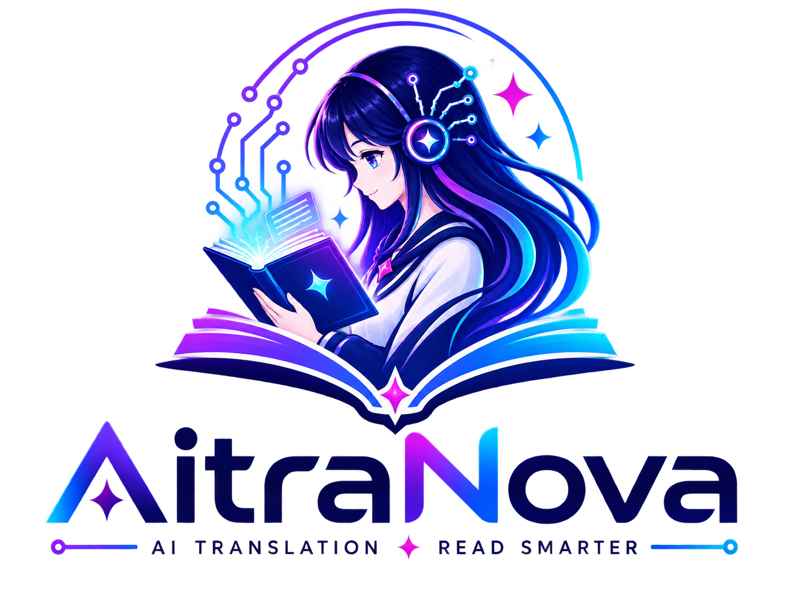
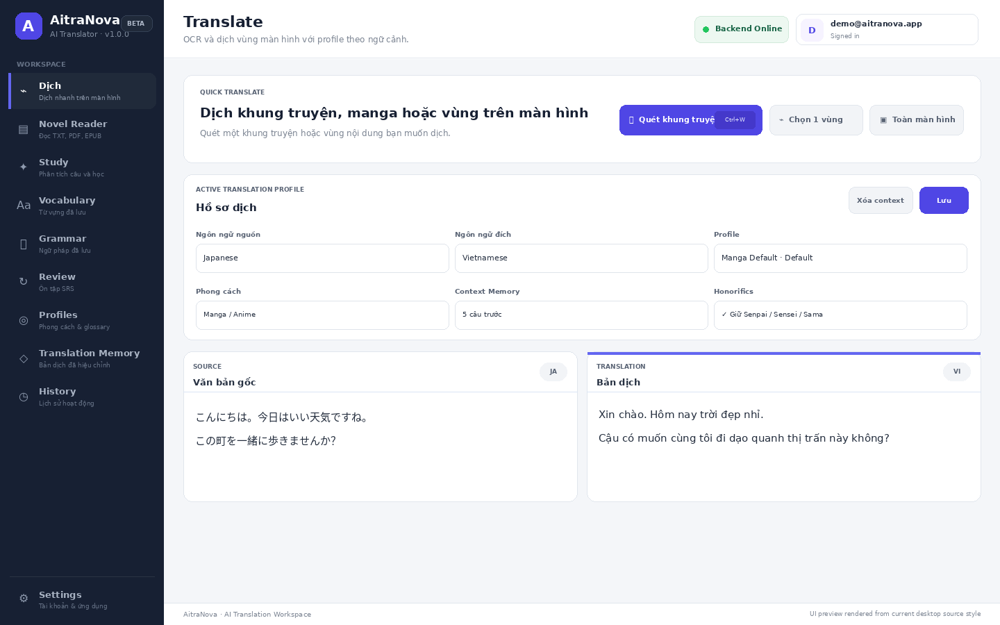
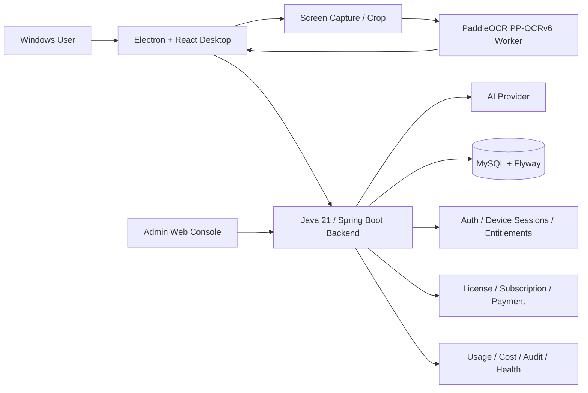

<div align="center">
  

# AitraNova · AI Translator Desktop

**Windows screen translation for manga, visual novels, games, documents, and language learning.**

[](https://openjdk.org/)
[](https://spring.io/projects/spring-boot)
[](https://www.electronjs.org/)
[](https://react.dev/)
[](https://www.mysql.com/)
[](https://github.com/PaddlePaddle/PaddleOCR)
[](https://railway.app/)
[](#)

**Production API:** `https://api.aitranova.com` · **Status:** Active development / Beta

</div>

---

## Overview

AitraNova is a Windows desktop translation platform designed for content that is inconvenient to copy manually: **Japanese manga, visual novels, games, images, PDFs, EPUB/TXT documents, and other on-screen text**.

The desktop client captures a selected screen region, sends it to a persistent **PaddleOCR PP-OCRv6 worker**, and forwards recognized text to a **Java 21 / Spring Boot backend** for AI-assisted translation. Translation profiles, character rules, glossary terms, context memory, and Personal Translation Memory help keep recurring names, terminology, and speaking styles consistent.

The project has grown beyond a screen OCR prototype into a full product-oriented system with authentication, device sessions, plan entitlements, quotas, licensing/subscriptions, payment workflows, AI usage/cost accounting, operational monitoring, and a separate administration console.

---

## Interface

### Translate Workspace

<p align="center">
  
</p>

<!--
Portfolio note:
The screenshot above is a source-based preview created from the current desktop design system.
Replace docs/screenshots/translate-workspace.png with a real packaged-app screenshot when available.
Keeping the same filename means this README does not need to change.
-->

The current desktop source contains dedicated workspaces for:

| Workspace | Purpose |
| --- | --- |
| **Translate** | Region OCR, manga panel scan, full-screen translation, translation profile controls |
| **Novel Reader** | Read and process TXT, PDF, and EPUB content |
| **Study** | Analyze captured text for language learning |
| **Vocabulary** | Save and manage vocabulary items |
| **Grammar** | Save and review grammar points |
| **Review** | Spaced-repetition review workflow |
| **Profiles** | Translation style, character rules, glossary, honorific and context settings |
| **Translation Memory** | Reuse user-corrected translations and manage saved corrections |
| **History** | Translation/activity history |
| **Settings** | Account, application, shortcut, appearance, and related preferences |

### Global shortcuts

| Shortcut | Action |
| --- | --- |
| `Ctrl + Shift + Q` | Quick region translation |
| `Ctrl + Shift + W` | Start / scan a manga panel session |
| `Ctrl + Shift + Y` | Translate the currently visible manga page / next-page workflow |
| `Ctrl + Shift + E` | Study scan |

Shortcuts are configurable in the desktop application.

---

## Core translation flow

```text
Ctrl + Shift + Q
        ↓
Select screen region
        ↓
Desktop screenshot
        ↓
Crop selected area
        ↓
Persistent PaddleOCR worker
        ↓
Recognized text
        ↓
Translation profile + context + memory
        ↓
Spring Boot backend
        ↓
AI translation
        ↓
Desktop overlay / workspace result
```

The OCR worker is kept alive instead of loading its model for every scan. Development supports a Python worker, while the desktop architecture also supports a packaged standalone OCR worker executable for distribution.

---

## Architecture



### Main components

```text
AI-Translator/
├── src/                    # React desktop UI
│   ├── components/
│   ├── pages/
│   ├── app/
│   └── assets/
│
├── electron/               # Electron main/preload/overlays
│   ├── main.cjs
│   ├── preload.cjs
│   ├── ocrWorkerManager.cjs
│   ├── fullScreenOverlay.cjs
│   ├── mangaBubbleDetector.cjs
│   └── ...
│
├── backend/                # Java 21 / Spring Boot API
│   ├── src/main/java/
│   ├── src/main/resources/
│   ├── mysql/
│   └── pom.xml
│
├── admin-web/              # Operations / commercial admin SPA
│   ├── index.html
│   ├── config.js
│   └── src/
│
└── docs/
    └── screenshots/
```

---

## Technology stack

### Desktop

- Electron
- React + TypeScript
- Vite-based UI architecture
- Sharp for image processing / cropping
- Electron `BrowserWindow` overlays
- Global shortcuts and tray integration

### OCR

- PaddleOCR **PP-OCRv6**
- Persistent OCR worker process
- Python worker fallback for development
- Standalone worker executable support for packaged builds

### Backend

- Java 21
- Spring Boot 4.1
- Spring MVC
- Spring Data JPA / Hibernate
- Spring Security
- JWT authentication and RBAC
- MySQL
- Flyway database migrations
- Bean Validation
- Spring Mail
- Actuator
- OpenAPI / Springdoc in development

### AI / translation

- Server-side AI provider integration
- Translation Profiles
- Character rules and aliases
- Glossary / terminology rules
- Context memory
- Personal Translation Memory
- Translation feedback
- AI usage and cost ledger

### Infrastructure / commercial layer

- Railway deployment
- MySQL production database
- Custom HTTPS API domain
- Device/session management
- Plans, features, entitlements, and quotas
- License / activation management
- Subscription and transaction workflows
- Lemon Squeezy webhook integration
- Admin audit, security events, error monitoring, and operational health

---

## Key features

### Screen & manga translation

- Select and translate a screen region without copying text manually.
- Manga panel scan and full-screen translation workflows.
- Persistent OCR worker to avoid model startup on every scan.
- Manga session / next-page workflow.
- Bubble-region detection using image-processing and OCR geometry heuristics.
- Translation shown inside desktop overlays instead of a separate browser page.

### Translation consistency

A translation profile can include:

- translation style (`NATURAL`, `MANGA`, `LITERAL`, `POLITE`)
- configurable context history
- honorific handling
- custom translation instructions
- character naming / speaking rules
- glossary entries

Personal Translation Memory can reuse user-approved corrections before requesting a new AI translation.

### Reader & learning tools

The desktop source includes:

- Novel Reader
- PDF text extraction / PDF OCR handling
- EPUB parsing
- Study analysis
- Vocabulary library
- Grammar library
- Review / SRS flows
- Learning dashboard-related backend services

### Account & product backend

The backend includes product-oriented services for:

- registration and authentication
- email verification and password reset
- social authentication flows
- JWT access tokens
- refresh-token device sessions
- device binding / transfer workflows
- plan entitlements and feature limits
- translation and manga quotas
- licenses and activations
- subscriptions and transactions
- AI usage / cost tracking

### Admin console

A separate Admin Web application provides operational tools for:

- users and access management
- plans, features, limits, and pricing
- licenses and activations
- subscriptions and payment transactions
- AI model costs and usage drill-down
- revenue, margin, and FX reporting
- security events
- audit logs
- operational health
- error / incident management
- server-enforced Admin **READ_ONLY** safety mode

---

## Security design

AitraNova keeps commercial provider credentials on the backend rather than shipping an AI API key inside the Electron client.

Current backend security architecture includes:

- Spring Security
- JWT access tokens
- RBAC for user/admin roles
- refresh-token device sessions
- server-side `ADMIN` / `SUPER_ADMIN` authorization checks
- server-side Admin READ_ONLY protection
- audit and security event tracking
- production startup validation
- production-only HTTPS/CORS requirements
- restricted production Actuator surface
- Swagger disabled in the strict production profile

> **Never commit secrets to this repository.** Database passwords, JWT secrets, AI provider keys, SMTP credentials, Railway credentials, payment secrets, and webhook secrets must remain in environment variables / deployment secret storage.

---

## Production deployment

The backend is deployed with MySQL on **Railway** and uses a custom HTTPS API domain:

```text
https://api.aitranova.com
```

The Spring Boot production profile expects server-side configuration such as:

```text
SPRING_PROFILES_ACTIVE=prod
DB_URL=<TLS-enabled MySQL JDBC URL>
DB_USERNAME=<database user>
DB_PASSWORD=<database password>
JWT_SECRET_BASE64=<secret>
OPENAI_API_KEY=<server-side key>
CORS_ALLOWED_ORIGINS=<trusted origins>
```

Do not place real values in source control.

The production profile is designed to fail startup when critical hardening is missing, including insecure CORS, blank critical secrets, exposed Swagger, overly broad Actuator exposure, or explicitly insecure database options.

---

## Local development

### Backend

Requirements:

- Java 21
- MySQL 8+

```bash
cd backend
./mvnw spring-boot:run
```

On Windows:

```powershell
cd backend
.\mvnw.cmd spring-boot:run
```

See the backend documentation files for authentication, database, profiles, sessions, learning features, and production configuration.

### Admin Web

```bash
cd admin-web
npm run dev
```

Development server:

```text
http://127.0.0.1:4174
```

The development configuration can point the console at a local backend. Production must disable arbitrary backend URL overrides and must run behind HTTPS.

### Desktop

The desktop application is built from the React UI under `src/` and the Electron process under `electron/`. Use the package scripts from the repository's root `package.json` for the current development/build commands.

For a public release, the target is a Windows installer where users do **not** need Python, VS Code, or a terminal.

---

## Current status

AitraNova is under active development. The codebase already contains the main desktop translation workspace, manga workflows, reader/learning modules, backend account/commercial services, and admin operations tooling.

Areas still suitable for future improvement include:

- signed Windows distribution / installer hardening
- broader multi-monitor and mixed-DPI testing
- production UX polishing
- true model-based manga bubble detection
- text inpainting / translated text replacement
- lower-latency live game translation
- additional automated integration and security testing

---

## Roadmap

- [x] Electron + React desktop foundation
- [x] Persistent PaddleOCR worker architecture
- [x] Screen region translation
- [x] Translation overlays
- [x] Translation Profiles / characters / glossary / context
- [x] Personal Translation Memory
- [x] Manga session workflows
- [x] Novel Reader and learning modules
- [x] Java Spring Boot commercial backend
- [x] Account / device sessions / entitlements
- [x] License / subscription / payment foundations
- [x] Admin operations console
- [x] Railway + MySQL deployment and custom API domain
- [ ] Final standalone Windows distribution hardening
- [ ] Model-based bubble detection
- [ ] Manga inpainting / translated text rendering
- [ ] Live game translation optimization

---

## Repository & portfolio notes

This repository is also used as a technical portfolio project. The main engineering focus is the **Java/Spring Boot backend architecture**, while the Electron client demonstrates a real desktop use case for the API.

When publishing screenshots or releases, avoid exposing:

- real user email addresses
- access/refresh tokens
- license keys
- payment/customer identifiers
- database credentials
- Railway environment variables
- API keys or webhook secrets
- private OCR/translation content

For recruiter-facing presentation, prefer screenshots, a short demo video, and GitHub Releases over asking someone to run an unsigned `.exe` immediately.

---

## Author

**Dang Thanh Long**  
Java Backend Developer

- GitHub: [github.com/thanhlong211](https://github.com/thanhlong211)
- Repository: [github.com/thanhlong211/AI-Translator](https://github.com/thanhlong211/AI-Translator)

---

<div align="center">
  <strong>AitraNova</strong><br/>
  <sub>AI Translation · Read Smarter</sub>
</div>
